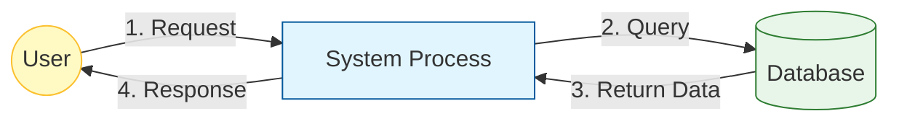

# Mermaid Flowchart Expert

This skill helps you create clear, accurate, and syntax-error-free Mermaid flowcharts, specifically optimized for data flow diagrams.

## 🎯 When to Use

- When the user asks to "draw a data flow diagram".
- When the user asks to "visualize the logic".
- When the user asks to "explain the data flow" with a diagram.
- When the user specifically mentions "Mermaid".

## ⚠️ Critical Syntax Rules (Anti-Hallucination)

To avoid common parsing errors in various Markdown renderers, **ALWAYS** follow these strict rules:

1.  **Quote ALL Node Text**:
    *   ❌ Incorrect: `A[Hello World]`
    *   ✅ Correct: `A["Hello World"]`
    *   **Reason**: Special characters like `()`, `[]`, `{}`, or even simple spaces can sometimes confuse parsers if not quoted.

2.  **Quote Text with HTML Tags**:
    *   ❌ Incorrect: `B[Line 1 Line 2]`
    *   ✅ Correct: `B["Line 1 Line 2"]`
    *   **Reason**: HTML tags inside node labels MUST be double-quoted.

3.  **Quote Edge Labels with Special Chars**:
    *   ❌ Incorrect: `A -->|Line 1 Line 2| B`
    *   ✅ Correct: `A --"Line 1 Line 2"--> B`
    *   **Reason**: Edge labels containing spaces or HTML tags must be quoted.

4.  **No `direction` in Subgraphs**:
    *   ❌ Incorrect: `subgraph Sub [Title] direction TB ... end`
    *   ✅ Correct: Remove `direction TB` from subgraphs unless absolutely necessary and you are sure the renderer supports it. Defaults are usually fine.

5.  **Subgraph Titles**:
    *   ❌ Incorrect: `subgraph Sub ["My Title"]` (Nested quotes can be risky)
    *   ✅ Correct: `subgraph Sub [My Title]` (Simple text) OR just `subgraph Sub` if title is not strictly needed.

6.  **Cross-Subgraph Edges**:
    *   Define edges *outside* of subgraphs whenever possible to avoid rendering confusion.

## 🎨 Best Practices for Data Flow

1.  **Left-to-Right Flow**: Use `graph LR` for data flow diagrams (Input -> Process -> Output).
2.  **Clear Roles**: Use subgraphs to group nodes by "Role" (e.g., Backend, Database, Frontend).
3.  **Entity Shapes**:
    *   `[]` for Processes/Actions (e.g., `Render["Render Page"]`)
    *   `()` for Start/End points
    *   `[()]` for Databases (e.g., `DB[("wp_options")]`)
    *   `{}` for Decisions (e.g., `Check{"Is Global?"}`)
4.  **Styling**:
    *   Use `style NodeId fill:#color,stroke:#color` to differentiate node types (e.g., Green for Success, Red for Error, Blue for Data).

## 📝 Template

