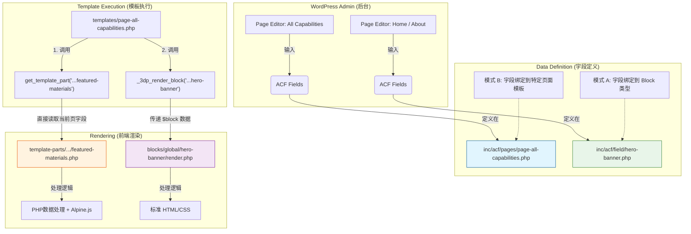

# 实用主义编程 (Pragmatic Programming) 与架构选择

在 WordPress 主题开发中，我们经常面临一个核心架构决策：**是将功能封装为独立的 Block (关注点分离)，还是将其作为 Page Template Part (局部性原理)？**

这两种模式没有绝对的优劣，而是取决于具体的业务场景。本文档通过对比 **Hero Banner (Block)** 和 **Featured Materials (Template Part)** 两个实例，阐述这两种模式的设计哲学、数据流向及适用场景。

## 1. 两种模式的核心哲学对比

### 模式 A：Block 模式 (关注点分离)
**代表实例：** `Hero Banner`
*   **核心思想**：**"Write Once, Use Everywhere"** (一次编写，到处使用)。
*   **架构特征**：
    *   **高内聚，低耦合**：Block 自包含样式和渲染逻辑，不依赖特定页面。
    *   **关注点分离 (SoC)**：数据定义 (`field`) 与 视图渲染 (`render`) 物理分离，强制解耦。
    *   **标准化契约**：通过 `block.json` 或 ACF 注册机制与 WordPress 核心交互。

### 模式 B：Template Part 模式 (局部性原理)
**代表实例：** `Featured Materials`
*   **核心思想**：**"YAGNI" (You Ain't Gonna Need It)** (你不需要它，除非现在就要用)。
*   **架构特征**：
    *   **高耦合，高效率**：代码直接依赖特定页面的数据上下文 (`get_field` 直接调用页面字段)。
    *   **局部性原理 (Locality)**：所有相关逻辑（数据获取、处理、展示）集中在一个文件中，修改时无需在多文件间跳转。
    *   **快速迭代**：省去了注册 Block、处理通用参数等"样板代码" (Boilerplate)。

---

## 2. 数据流动全景图 (Data Flow)

下面的流程图展示了这两种模式从 **后台数据输入** 到 **前台页面渲染** 的完整数据链路。

### 关键区别解析
1.  **数据源头**：
    *   **Template Part** (`F1`): 字段定义直接绑定在 `Page Template` 上。数据属于 **页面 (Page)**。
    *   **Block** (`F2`): 字段定义绑定在 `Block` 上。数据属于 **区块实例 (Block Instance)**。

2.  **调用方式**：
    *   **Template Part** (`TP`): 是一种 **"包含" (Include)** 关系。它假设父级环境已经准备好了数据（当前页面的 ACF 字段）。
    *   **Block** (`BL`): 是一种 **"函数调用" (Function Call)** 关系。父级通过 `_3dp_render_block` 显式地将数据包 (`$block`) 传递给渲染函数。

---

## 3. 决策指南：我该选哪种？

### 黄金法则：编辑器决策法
最简单、最有效的判断标准：**“运营人员是否需要在古腾堡编辑器中手动插入这个模块？”**

#### 场景 A：需要手动插入 -> 使用 Block
*   **适用场景**：博客文章 (Blog Posts)、通用页面 (General Pages)、营销着陆页 (Landing Pages)。
*   **用户行为**：运营人员在撰写文章时，突然想：“这里我需要插一个 CTA 按钮” 或者 “这里我需要插一个产品对比表”。
*   **典型例子**：
    *   CTA 模块 (Call to Action)
    *   产品卡片 (Product Card)
    *   高亮引言 (Blockquote)
    *   数据表格 (Comparison Table)
    *   FAQ 手风琴 (Accordion)

#### 场景 B：不需要手动插入 -> 使用 Template Part
*   **适用场景**：首页 (Homepage)、关于页 (About Us)、服务页 (Services)、页眉/页脚 (Header/Footer)。
*   **用户行为**：页面的结构是固定的，由设计师设计好，开发者写死在代码里。运营人员只需要填空（改标题、改图片），不需要（也不应该）移动模块的位置。
*   **典型例子**：
    *   首页 Hero Banner
    *   页脚导航
    *   服务页的“我们的流程”步骤图
    *   关于页的“团队介绍”网格
    *   **列表页的分页组件 (Pagination)**

---

## 4. 最佳实践总结

*   **Template Parts First (模版优先)**：
    *   默认情况下，优先将模块写成 Template Part。
    *   优势：性能更好（纯 PHP include），代码更少（无需注册 Block），控制力更强。
    
*   **升级为 Block 的时机**：
    *   只有当运营明确提出“我想在文章里随便插这个东西”时，再将其升级重构为 Block。
    
*   **混合架构 (Hybrid Architecture)**：
    *   一个成熟的 WordPress 站点通常是混合架构。
    *   **首页/核心页**：使用 Template Parts 保证极致的定制化和性能。
    *   **博客/文章页**：使用 Blocks 保证内容编辑的灵活性。
    *   **通用组件**：如果一个模块（如 CTA）既要在首页固定位置显示，又要在文章中随意插入，**把它做成 Block**，然后在首页模板里使用 `_3dp_render_block` (或类似封装) 进行调用。

*   **不要过早优化 (Premature Optimization)**：
    *   不要为了“可能用到”而把所有东西都做成 Block。这会带来不必要的复杂度和维护成本。
