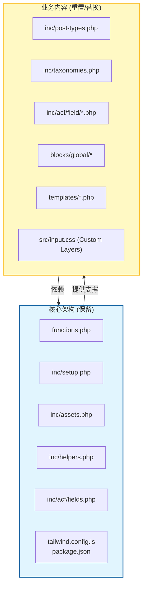

# 未来项目架构与脚手架规划 (Future Project Scaffold & Architecture)

本文档旨在探讨如何将当前的 GeneratePress Child 项目结构提炼为一个通用的 WordPress 开发脚手架，以便在未来的项目中快速启动，同时规避常见的“复制粘贴”陷阱。

## 1. 脚手架的核心理念 (Core Philosophy)

我们希望构建一个 **"Battery Included, but Replaceable"** (开箱即用，但易于替换) 的脚手架。

*   **保留 (Keep)**: 基础设施、构建工具、配置加载逻辑、辅助函数。
*   **重置 (Reset)**: 具体业务内容、特定样式、特定分类法、特定 CPT。
*   **抽象 (Abstract)**: 将硬编码的业务逻辑（如 `_3dp_` 前缀）替换为通用的占位符。

---

## 2. 理想的脚手架目录结构 (Scaffold Directory Structure)

这是新项目 "Day 1" 的理想状态：

```text
/wp-content/themes/your-project-name/
├── functions.php              # [保留] 通用加载器 (需替换 TextDomain)
├── style.css                  # [重置] 仅保留头部注释结构
├── tailwind.config.js         # [保留] 保留配置结构，重置 colors/fonts 为通用默认值
├── package.json               # [保留] 构建脚本 (build, watch)
├── src/
│   └── input.css              # [保留] Tailwind 基础引入 (@tailwind base; ...)
├── inc/
│   ├── setup.php              # [保留] 基础配置 (Gutenberg 开关、SVG 支持等)
│   ├── assets.php             # [保留] 资源加载逻辑 (自动加载 style.css, Alpine.js)
│   ├── helpers.php            # [保留] 核心工具函数 (_3dp_render_block 等，需改名)
│   ├── admin-filters.php      # [可选] 仅保留通用优化 (如 SVG 上传支持)
│   ├── options-page.php       # [重置] 提供一个空的 "Global Options" 示例
│   ├── post-types.php         # [重置] 提供一个注释掉的 CPT 注册示例
│   ├── taxonomies.php         # [重置] 提供一个注释掉的 Taxonomy 注册示例
│   └── acf/
│       ├── blocks.php         # [重置] 空的注册列表
│       ├── fields.php         # [保留] 自动加载逻辑
│       └── field/             # [清空]
├── blocks/
│   └── global/                # [清空] 或保留一个 'example-block'
├── templates/                 # [清空]
└── template-parts/
    ├── header/                # [重置] 通用 Header 结构
    ├── footer/                # [重置] 通用 Footer 结构
    └── components/            # [保留] 通用组件 (如 button, pagination)
```

---

## 3. 核心与业务的分离 (Separation of Core vs. Content)

我们在克隆项目时，必须清晰地区分哪些是**核心架构**，哪些是**业务内容**。



---

## 4. 迁移与重构清单 (Migration Checklist)

在新项目开始时，必须执行以下“大扫除”操作：

### 4.1 命名空间与前缀 (Namespace & Prefixes)
*   **Text Domain**: 搜索全项目 (Search in Files) 替换 `'3d-printing'` 为 `'new-project-slug'`。
*   **Function Prefix**: 搜索替换 `_3dp_` 为 `_newproj_` (或者使用更通用的 `_core_` 作为脚手架默认值)。
*   **Constant Prefix**: `TDP_` (3D Printing) -> `NEWPROJ_`。

### 4.2 清理特定配置 (Configuration Cleanup)
1.  **`inc/setup.php`**:
    *   移除 `register_nav_menus` 中特定的菜单位置 (如 `footer_capabilities`)，只保留 `primary` 和 `footer`。
    *   移除针对特定 Template 的 Gutenberg 开关逻辑。
2.  **`inc/assets.php`**:
    *   移除特定的 Google Fonts (Inter/JetBrains Mono)，替换为新设计所需的字体或系统默认字体。
    *   检查是否需要 Swiper/Alpine.js，不需要则注释掉。
3.  **`tailwind.config.js`**:
    *   重置 `theme.extend.colors`：移除 `industrial`, `panel` 等特定业务色，保留 `primary`, `secondary` 等语义化颜色。
    *   重置 `fontFamily`。

### 4.3 数据库与 ACF (Database & ACF)
*   **ACF JSON**: 如果开启了 ACF Local JSON，务必清空 `acf-json/` 文件夹，否则新项目会读取旧项目的字段定义。
*   **Options Page**: 确保数据库中 `wp_options` 表里的 `options_global_xxx` 数据是空的，避免脏数据干扰。

---

## 5. 潜在陷阱 (Pitfalls & Traps)

在复用代码时，最容易掉进以下陷阱：

### 5.1 硬编码的 ID 和 Slug
*   **陷阱**: 代码中写死了 `get_page_by_path('materials')` 或 `if ($post->ID === 12)`。
*   **解决**: 永远不要在脚手架中保留 ID 判断。如果必须，使用 `get_option('page_on_front')` 或通过 ACF Options Page 设置页面关联。

### 5.2 ACF Field Key 冲突
*   **陷阱**: 直接复制 `field_123456` 的 PHP 导出代码。虽然 ACF 会处理，但在 Local JSON 模式下，如果两个项目共享同一个 Git 仓库或文件复制，可能会导致字段 Key 冲突或同步混乱。
*   **解决**: 新项目最好重新生成 Field Groups，或者在导入时确保 Key 的唯一性。

### 5.3 菜单位置 (Menu Locations)
*   **陷阱**: `inc/setup.php` 注册了 `footer_materials`，但在新项目中删除了这个位置，前端调用 `wp_nav_menu` 时会报错或不显示。
*   **解决**: 脚手架中只保留最基础的 `primary` 菜单，其他按需添加。

### 5.4 插件依赖 (Plugin Dependencies)
*   **陷阱**: 代码依赖 `ACF Pro` 或 `Safe SVG`，但新环境未安装。
*   **解决**: 在 `functions.php` 增加 `is_plugin_active` 检查，或者在 `README.md` 中明确列出依赖清单。

---

## 6. 脚手架化建议 (Action Plan)

建议将当前项目剥离为一个独立的 GitHub 仓库 `wp-starter-theme`：

1.  **保留核心文件** (`inc/setup.php`, `assets.php`, `helpers.php`, `functions.php`)。
2.  **泛化命名**：将 `_3dp_` 批量替换为 `_starter_`。
3.  **创建示例**：保留一个 `blocks/global/example-block` 作为参考。
4.  **编写文档**：在 `README.md` 中写明 "How to rename project" (如何重命名项目)。

这样，下一个项目启动时，只需 `git clone` -> `Search & Replace` -> `npm install` 即可开始开发，节省 1-2 天的基础配置时间。
