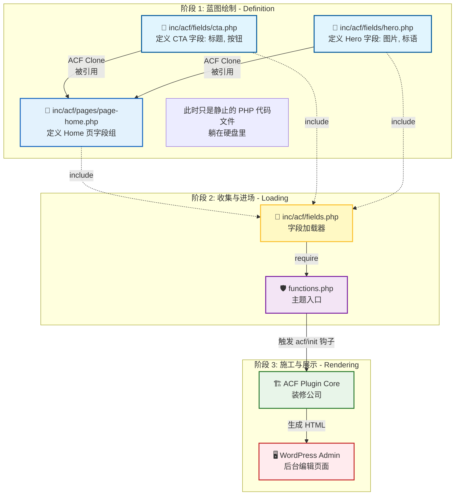

# 后台字段渲染流程 (Backend Field Rendering Flow)

本文档详细解释了 WordPress 后台 AC F 字段是如何从一个个独立的 PHP 文件，最终变成后台编辑页面上的输入框的。

这是一个从 **定义(Definition)** 到 **组装(Composition)** 再到 **注册(Registration)** 最后 **渲染(Rendering)** 的完整过程。

## 🏗️ 核心角色隐喻

为了方便理解，我们继续使用"建筑装修"的比喻：

| 角色 | 文件/组件 | 职责 |
| :--- | :--- | :--- |
| 📄 **原子图纸** | `inc/acf/fields/*.php` | 定义单个模块（如 CTA, Hero）的具体规格（有哪些输入框）。 |
| 📑 **整屋设计图** | `inc/acf/pages/*.php` | 定义某个特定页面（如 Home）的完整布局。它通过 **引用 (Clone)** 原子图纸来组合页面。 |
| 👷 **工头 (Loader)** | `inc/acf/fields.php` | 负责收集所有的图纸（原子图纸 + 整屋设计图），确保没有遗漏。 |
| 🛡️ **保安 (Boot)** | `functions.php` | 网站的入口守卫。它批准工头进场工作（`require` 文件）。 |
| 🏗️ **装修公司** | **Advanced Custom Fields (ACF)** | 插件本身。它拿到工头给的所有图纸，在后台"施工"，把输入框画出来。 |

---

## 🔄 数据流动图 (Data Flow)

---

## 📝 详细步骤解析

### 1. 绘制原子图纸 (Module Definition)
**文件位置**: `inc/acf/fields/cta.php`
- 程序员定义了 CTA 模块有哪些字段（Title, Button Text, Link 等）。
- 这是一个独立的、可复用的单元。

### 2. 绘制整屋设计图 (Page Composition)
**文件位置**: `inc/acf/pages/page-home.php`
- 程序员定义了 "Home Page" 需要哪些模块。
- **关键动作**: 使用 `acf_add_local_field_group` 创建一个大组，并在其中使用 `clone` 字段引用了 CTA 和 Hero 的 Key。
- 此时，Home 页面的字段结构已经确定，但 WordPress 还不知道它的存在。

### 3. 工头收集图纸 (The Loader)
**文件位置**: `inc/acf/fields.php`
- 这个文件包含了一系列的 `require_once` 或 `glob` 循环。
- 它的作用是把上面定义的所有 PHP 文件（`fields/*.php` 和 `pages/*.php`）都读取进内存。
- 如果没有这个文件，PHP 就像散落在地上的书页，没人去读它们。

### 4. 保安放行 (The Boot)
**文件位置**: `functions.php`
- `functions.php` 是主题启动时第一个执行的文件。
- 它包含一行代码：`require_once get_stylesheet_directory() . '/inc/acf/fields.php';`。
- 这行代码告诉 WordPress：“嘿，启动的时候，记得把负责字段的工头（`fields.php`）叫进来”。

### 5. 装修公司施工 (ACF Execution)
**执行者**: ACF 插件
- 当 WordPress 加载到 `acf/init` 钩子时，ACF 插件开始工作。
- 它发现内存里已经注册了一堆字段组（由步骤 3 完成）。
- 它根据 `location` 规则（例如：`post_type == 'page' AND page_template == 'front-page.php'`），判断当前用户正在编辑的页面是否符合条件。
- 如果符合，它就根据图纸生成 HTML（输入框、图片上传器等），显示在后台页面上。

## 💡 为什么要这么繁琐？

你可能会问：*为什么不直接在 functions.php 里写死所有字段？*

1.  **解耦 (Decoupling)**: 就像盖房子，你不会把图纸画在保安室的墙上。图纸应该归档在档案室（`inc/acf/*`）。
2.  **可维护性 (Maintainability)**: 如果所有字段都写在 `functions.php`，那个文件会有几千行，难以阅读。
3.  **复用性 (Reusability)**: 独立的 `cta.php` 可以被 Home 页引用，也可以被 Contact 页引用，修改一处，处处生效。
