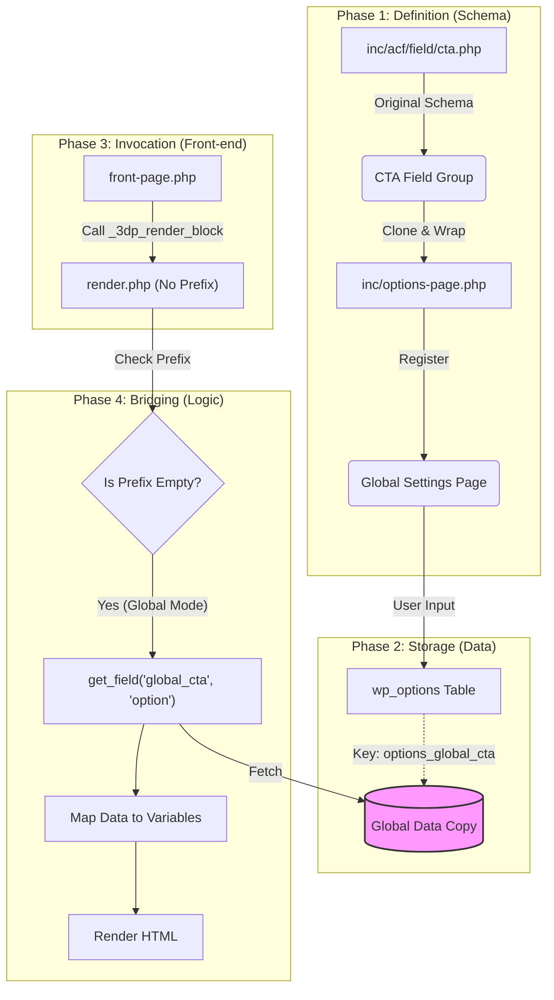

# 全局模块数据流向解析 (Global Modules Data Flow)

本文档详细解释了从 **ACF Options Page (后端)** 到 **前端页面显示** 的完整数据流动过程，以 `CTA (Call to Action)` 模块为例。

## 1. 核心概念

在理解数据流之前，需要明确两个核心概念：

*   **Source of Truth (数据源)**: `inc/options-page.php` 定义了全局数据的存储结构。
*   **Renderer (渲染器)**: `blocks/global/cta/render.php` 是一个智能模板，它能根据传入参数决定是读取 **全局数据** 还是 **当前页面数据**。

## 2. 数据流动全景图 (Data Flow Diagram)



## 3. 详细步骤解析

### 第一步：数据定义与存储 (Backend)

*   **文件**: `inc/options-page.php`
*   **行为**: 我们定义了一个名为 `global_cta` 的 Group 字段，并在其中 Clone 了 CTA 的字段组。
*   **本质**: ACF Clone 仅仅克隆了“字段定义 (Schema)”，并没有克隆数据。它相当于在 Global Settings 页面创建了一份**独立的副本表格**（CTA 1号）。
*   **存储**: 当你在后台 "Global Settings" -> "Global Modules" 填写内容并保存时，数据被存储在 `wp_options` 表中。这些数据与原始 CTA 模块没有任何直接的数据关联，它们是独立的实体。

### 第二步：模板调用 (Template Invocation)

*   **文件**: `front-page.php`
*   **代码**:
    ```php
    _3dp_render_block( 'blocks/global/cta/render', array( 'id' => 'home-cta' ) );
    ```
*   **关键点**: 注意这里的参数数组 `array( 'id' => 'home-cta' )`。**它没有传递 `prefix` 参数**。这是触发全局模式的关键信号。

### 第三步：智能渲染逻辑 (Smart Rendering)

*   **文件**: `blocks/global/cta/render.php`
*   **逻辑**: 原本的渲染代码之所以能读取到 Options Page 里的“副本数据”，完全是因为我们在代码中编写了**桥接逻辑**。

    ```php
    // 1. 获取前缀（如果有的话）
    $pfx = isset($block['prefix']) ? $block['prefix'] : '';

    // 2. 分支判断
    if ( empty( $pfx ) ) {
        // === 分支 A: 全局模式 (Global Mode) ===
        // 既然没有前缀，说明调用者希望使用全局默认数据。
        // 【关键桥接】显式调用 get_field(..., 'option') 去读取那个"副本数据"
        $global_data = get_field('global_cta', 'option'); 
        
        // 解析数据并赋值给变量
        if ( $global_data ) {
            $cta_title = $global_data['cta_title'];
            // ...
        }
    } else {
        // === 分支 B: 局部模式 (Local Mode) ===
        // 有前缀，说明这是某个具体页面特有的。
        // 读取当前 Post 的数据
        $cta_title = get_field_value('cta_title', ..., $pfx);
    }
    ```

### 第四步：最终输出 (Output)

*   获取到 `$cta_title` 等变量后，HTML 模板部分（即 PHP 文件的下半部分）开始执行，生成最终的 HTML 代码并插入到页面流中。

## 4. 总结：ACF Clone 的本质

1.  **Schema 复用**: `options-page.php` 复用了 `field/cta.php` 的**结构定义**，确保后台表单长得一样。
2.  **Data 隔离**: Global Settings 里的数据是**独立存储**的，和任何 Page 里的 CTA 数据互不干扰。
3.  **Render 桥接**: `render.php` 通过 `if (empty($pfx))` 逻辑，充当了**桥梁**，手动去 Options Page 抓取那份独立存储的数据来渲染。
