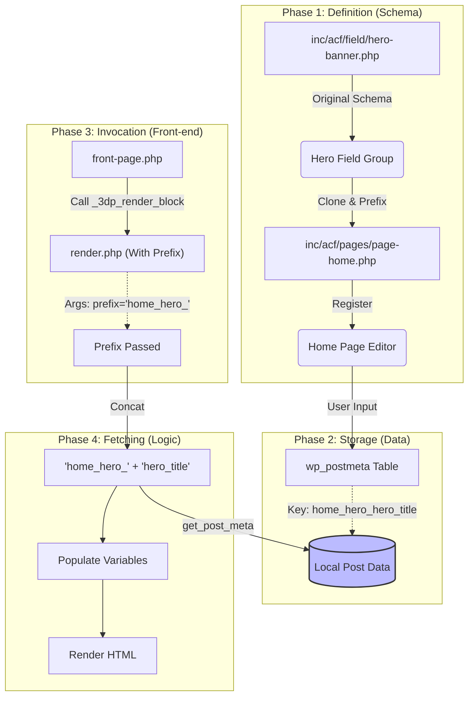

# 局部模块数据流向解析 (Local Modules Data Flow)

本文档详细解释了从 **ACF Field Configuration (后端)** 到 **前端页面显示** 的局部模块数据流动过程，以 `Hero Banner` 在首页 (Home Page) 的应用为例。

与 [Global Modules Data Flow](data-flow-global-modules.md) 不同，局部模块的数据存储在当前页面的 `post_meta` 中，不需要跨页面查找。

## 1. 核心概念

*   **Scope (作用域)**: Local Data 仅属于当前页面 (Post/Page)，与其他页面隔离。
*   **Prefix (前缀)**: 为了在同一个页面中使用多个相同类型的模块（例如两个 Hero），或者区分不同区域的字段，我们使用 **Prefix** 来作为命名空间。

## 2. 数据流动全景图 (Data Flow Diagram)



## 3. 详细步骤解析

### 第一步：数据定义与存储 (Backend)

*   **文件**: `inc/acf/pages/page-home.php`
*   **代码**:
    ```php
    array(
        'key' => 'field_home_overview_hero_clone_v2',
        'label' => 'Hero Banner',
        'name' => 'home_hero',  // <--- Wrapper Name
        'type' => 'clone',
        'clone' => array( 0 => 'group_hero_banner' ),
        'display' => 'group',
        'prefix_name' => 1,     // <--- 关键！开启前缀
    ),
    ```
*   **行为**: 因为设置了 `prefix_name => 1`，ACF 会自动将 Wrapper Name (`home_hero`) 作为前缀添加到所有子字段名前。
*   **存储**: 当你在后台编辑 Home 页面时，数据被存储在 `wp_postmeta` 表中。
    *   **Key**: `home_hero_hero_title` (Wrapper + Original Name)
    *   **Value**: "Your Streamlined 3D Printing Service"

### 第二步：模板调用 (Template Invocation)

*   **文件**: `front-page.php`
*   **代码**:
    ```php
    _3dp_render_block( 'blocks/global/hero-banner/render', array( 
        'id'     => 'home-hero', 
        'prefix' => 'home_hero_' // <--- 传递对应的前缀
    ) );
    ```
*   **关键点**: 这里传递的 `prefix` 必须与第一步中生成的数据库字段前缀完全匹配。通常是 `Wrapper Name` + `_`。

### 第三步：渲染逻辑 (Render Logic)

*   **文件**: `blocks/global/hero-banner/render.php`
*   **逻辑**:

    ```php
    // 1. 获取传入的前缀
    $pfx = isset($block['prefix']) ? $block['prefix'] : ''; // 'home_hero_'
    
    // 2. 确定 Clone Name (用于 get_field_value 内部逻辑)
    $clone_name = rtrim($pfx, '_'); // 'home_hero'

    // 3. 取数
    // get_field_value 辅助函数会尝试拼接: $pfx + $field_name
    // 即查找: 'home_hero_' + 'hero_title'
    $title = get_field_value('hero_title', $block, $clone_name, $pfx, ...);
    ```

### 第四步：最终输出 (Output)

*   获取到 `$title` 等变量后，HTML 模板部分开始执行，渲染出属于首页特有的 Hero Banner。

## 4. 总结：Local Modules 的特点

1.  **直接关联**: 数据直接存在于当前页面，不涉及跨页面查找。
2.  **命名空间 (Namespace)**: 通过 Prefix 机制，我们可以在同一个页面放多个相同类型的模块（比如 Top Hero 和 Bottom Hero），只要给它们不同的 Prefix（如 `top_hero_` 和 `bottom_hero_`），数据就不会冲突。
3.  **配置一致性**: 前端调用的 `prefix` 参数必须严格对应后台 ACF 定义的 `Wrapper Name`。
