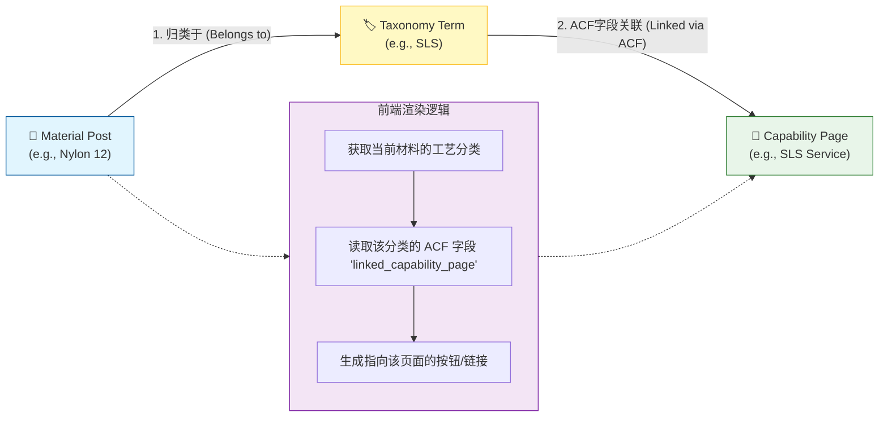

# Taxonomy ACF 字段扩展逻辑 (Taxonomy Field Extension)

本文档解释了如何使用 ACF 为 WordPress 的分类法 (Taxonomy) 添加额外字段，从而实现分类术语 (Term) 与具体页面 (Page/Post) 的关联。

以 `material_process` (工艺) 分类为例，我们通过 ACF 字段实现了 "分类 -> 能力页" 的智能桥接。

## 🎯 核心目标

我们希望实现以下场景：
1.  **分类管理**: 在后台管理 "Material Process" 时，不仅能写名字（如 "SLS"），还能给它关联一个具体的 "Capability Page"（如 "SLS 3D Printing Service"）。
2.  **前端自动化**: 当用户浏览某个材料（如 "Nylon 12"）时，系统能自动识别它属于 "SLS" 工艺，并直接提供跳转到 "SLS 服务页" 的链接，而不需要人工手动去填链接。

---

## 🏗️ 架构角色

| 文件路径 | 角色 | 职责 |
| :--- | :--- | :--- |
| `inc/taxonomies.php` | **创建者 (Creator)** | 注册分类法本身 (`material_process`)，定义其名称和层级结构。 |
| `inc/acf/taxonomy/material-process.php` | **装修者 (Decorator)** | 为该分类法添加额外的 ACF 字段 (`linked_capability_page`)。 |

---

## 🔄 数据流向图 (Data Flow)

这是一个典型的 **"桥接" (Bridging)** 模式：



---

## 📝 代码实现解析

### 1. 字段定义 (`inc/acf/taxonomy/material-process.php`)

```php
acf_add_local_field_group( array(
    'key' => 'group_material_process_details',
    'title' => 'Process Details',
    'fields' => array(
        array(
            'key' => 'field_tax_linked_capability',
            'label' => 'Linked Capability Page', // 字段名
            'name' => 'taxonomy_linked_capability',
            'type' => 'post_object', // 类型：文章对象选择器
            'post_type' => array( 'capability' ), // 限制：只能选 Capability 类型的文章
            'return_format' => 'object', // 返回：完整的 Post 对象（含 ID, Title, Permalink）
        ),
    ),
    'location' => array(
        array(
            array(
                'param' => 'taxonomy',
                'operator' => '==',
                'value' => 'material_process', // 规则：只在 Material Process 分类编辑页显示
            ),
        ),
    ),
) );
```

### 2. 后台操作体验

1.  进入 **Products > Material Process**。
2.  点击编辑 "SLS" 术语。
3.  在页面下方会看到一个新的 **"Linked Capability Page"** 下拉框。
4.  选择 "SLS 3D Printing" 页面并保存。

### 3. 前端调用示例

在 `single-material.php` 或相关模板中：

```php
// 1. 获取当前材料所属的工艺分类
$terms = get_the_terms( get_the_ID(), 'material_process' );

if ( ! empty( $terms ) && ! is_wp_error( $terms ) ) {
    foreach ( $terms as $term ) {
        // 2. 获取该分类关联的 Capability 页面对象
        // 注意：ACF 在 Term 上取值需要用 'taxonomy_term_ID' 格式，或者直接传 Term 对象
        $linked_page = get_field( 'taxonomy_linked_capability', $term );

        if ( $linked_page ) {
            // 3. 输出链接
            echo '<a href="' . get_permalink( $linked_page->ID ) . '">';
            echo 'Learn more about ' . $term->name;
            echo '</a>';
        }
    }
}
```

## 💡 为什么要这样做？

*   **解耦 (Decoupling)**: 不需要把 URL 写死在代码里。如果 Capability 页面的 URL 变了，这里会自动更新（因为存的是 Post ID）。
*   **灵活性 (Flexibility)**: 运营人员可以随时更改关联关系，无需开发人员介入。
*   **数据一致性 (Consistency)**: 保证了所有属于同一工艺的材料，都会指向同一个服务介绍页，避免了手动填写入为错误。
