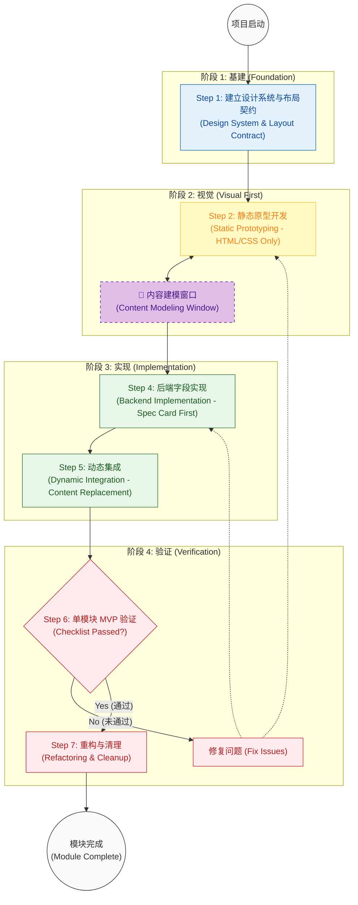

# 全栈开发标准化流程 SOP (视觉优先，后端后置)

本文档总结了一套基于 "Component-Driven Development" (CDD) 的 WordPress + Tailwind CSS 全栈开发标准化流程。

**核心思想：先装修，后通电。**

在没有看见房子（前端页面）长什么样之前，不要先去买家具（定义后端字段）。避免 "盲目开发 -> 集成地狱 -> 痛苦重构" 的循环。

---

## 1️⃣ 核心理念 (Core Philosophy)

### 装修 vs 通电
*   **装修 (Phase 1-2)**：先盖房子、刷墙、摆家具（HTML/CSS）。这个时候房子是"死"的，但它是"好看"的。
*   **通电 (Phase 4-5)**：最后才拉电线、装开关（PHP/ACF）。让房子"活"起来。
*   **误区**：很多人习惯一边砌墙一边拉电线，结果墙还没砌好，电线已经乱成一团麻。

### 开发哲学对比

| 以前的痛苦做法 (The Hard Way) | 现在的标准化做法 (The Smart Way) |
| :--- | :--- |
| **模块化优先**：上来就想做成通用的 Block | **页面优先**：先做成 Page Template，确实需要复用再拆分 |
| **后端先行**：先写 ACF 字段，再想怎么显示 | **视觉先行**：先写 HTML/Tailwind，看着页面定字段 |
| **盲目堆砌**：做完一个模块下一个，不看整体 | **单模块闭环**：做一个，成一个，验一个 |
| **认知过载**：每次都要思考怎么设计数据结构 | **决策模板**：使用“数据三问”和“Spec Card”自动化决策 |

---

## 2️⃣ 流程总览图 (Process Flowchart)



---

## 3️⃣ 强制提交节点 (Mandatory Commit Points)

为防止代码混乱，**必须**在以下节点执行 Git Commit，禁止跨阶段混合提交。

| 节点类型 | 提交时机 | Commit Message 示例 |
| :--- | :--- | :--- |
| **STATIC** | 静态原型开发完成 (Step 2) | `feat(visual): complete hero section static prototype` |
| **MODEL** | 字段结构确定 (Step 4) | `feat(acf): define hero module fields structure` |
| **DYNAMIC** | 动态替换完成 (Step 5) | `feat(integration): integrate hero module with acf data` |

---

## 4️⃣ 工业级开发流程详解 (Detailed SOP)

我们将开发过程升级为 7 个阶段，**严格禁止跳级**。

### 阶段 1：建立设计系统与布局契约 (Design System & Layout Contract)
**目标**：在写第一行 HTML 之前，先立法。

*   **核心动作**：
    1.  **定义 Tailwind Config (The Constitution)**：
        *   **Container**: 确立最大宽度 (e.g., `max-w-7xl`, `px-4`).
        *   **Spacing Scale**: 确立间距标准 (e.g., `section-spacing: py-20`, `gap-8`).
        *   **Color Tokens**: 确立主色、辅色、背景色，而不是使用魔法数值。
        *   **Typography**: 确立 H1-H6 的大小和行高。
    2.  **全局样式重置 (Global Reset)**：
        *   在 `src/input.css` 中 (`@layer base`) 清除主题默认样式，确保 Tailwind 是**唯一**样式来源。
*   ** 专家洞察**：没有 Layout Contract，页面维护将成为噩梦。**单一权威 (Single Authority)** 是解决 CSS 冲突的唯一方案。

---

### 阶段 2：静态原型开发 (Static Prototyping) —— **🚨 视觉优先核心**
**目标**：所见即所得。完全不碰 ACF，完全不写 PHP 逻辑。

*   **核心动作**：
    1.  **还原设计稿 (HTML + Tailwind)**：直接在 `front-page.php` 或 `templates/xxx.php` 中写**死数据**。
    2.  **堆叠式开发**：把 Hero, Features, CTA 全部堆在一个文件里写，不要急着拆分文件。
    3.  **专注视觉**：解决 Margin, Padding, Mobile 响应式。
    4.  **验证视觉**：浏览器里看到的页面应该和设计稿**一模一样**。
*   **🚫 常见误区 (Don'ts)**：
    *   **后端思维陷阱 (Backend-First Trap)**：先让 AI 生成后端字段，甚至让 AI 盲写前端渲染代码。因为没有做模板，完全看不到模块长什么样，相当于"瞎子摸象"。
*   **💡 专家洞察**：不要"盲写代码"。看着静态页面，你就知道："哦，这个标题需要换行，那个按钮可能没有链接"，字段需求自然就清晰了。

---

### 🔁 内容建模窗口 (Content Modeling Window)
**性质**：这不是一个串行阶段，而是连接视觉与后端的**过渡思考窗口**。

*   **核心动作**：
    1.  **数据决策三问 (The 3-Question Decision)**：
        *   Q1: 这个内容会不会有独立页面？(YES -> CPT / NO -> Next)
        *   Q2: 会不会出现多条？(YES -> Repeater / NO -> Next)
        *   Q3: 是否多个页面共享？(YES -> Global Option / NO -> Local Group)
    2.  **抽象实体**：确定是 "Feature List" 还是 "Testimonial" 实体。
*   ** 专家洞察**：设计的是"内容模型"，而不是"UI 控件"。使用固定决策模板减少认知负担。

---

### 阶段 4：后端字段实现 (Backend Implementation)
**目标**：将模型转化为 ACF 字段，**Module Spec Card 优先**。

*   **核心动作**：
    1.  **编写 Module Spec Card**：在写代码前，花 30 秒写下：
        ```text
        MODULE: Hero
        STRUCTURE: title(text), image(img), cta(link)
        PREFIX: hero_
        REUSABLE: No
        ```
    2.  **创建字段**：严格按照 Spec Card 命名，Global 模块必须加前缀。
    3.  **注册字段**：使用 `inc/acf/fields.php` 加载。
    4.  **输入测试数据**：在后台填入与设计稿一致的数据。
*   ** 专家洞察**：**Module Spec Card** 是单人开发神器，能解决 80% 的混乱和重构问题。

---

### 阶段 5：动态集成 (Dynamic Integration) —— "通电"
**目标**：将静态 HTML 替换为 PHP 变量，**严格执行替换规则**。

*   **核心动作**：
    1.  **模块抽离**：将阶段 2 的 HTML 剪切到 `template-parts/` 或 `blocks/` 下的渲染文件中。
    2.  **数据注入**：PHP 头部获取数据 `get_field('prefix_text')`。
    3.  **替换规则 (Replacement Rules)**：
        *   只替换内容 (Text/Image URL)。
        *   **严禁**修改 HTML 结构 (DOM)。
        *   **严禁**修改 CSS 类名 (Classes)。
*   ** 专家洞察**：**简化层级**。AI 和人都容易犯错，严格遵守“只换数据不换骨架”的原则。

---

## 5️⃣ 集成验证规则 (Integration Verification)

为确保集成过程没有破坏视觉结构，**必须**执行以下检查：

### 🚨 Git Diff 检查
Phase 5 集成完成后，执行 `git diff`。检查范围**只允许**包含：
*   PHP 变量注入
*   `get_field()` 调用
*   `echo` 输出

**如果出现以下变化，必须回滚 (Revert)**：
*   ❌ HTML 标签变化 (如 `div` 变 `section`)
*   ❌ CSS 类名变化 (如 `p-4` 变 `p-6`)
*   ❌ DOM 层级变化

---

## 6️⃣ MVP 验证与失败决策 (Verification & Failure Decision)

**目标**：确保当前模块完美无缺，再做下一个。

### 必须通过的 Checklist
*   [ ] **渲染正确**：前端显示与静态原型一致。
*   [ ] **响应式完美**：Mobile/Desktop 均无问题。
*   [ ] **Layout Contract**：Spacing/Container 合规。
*   [ ] **后台易用性 (Backend Usability)**：字段顺序合理，Label 清晰，Repeater 容易操作。

### � 失败决策树 (Failure Decision Tree)
遇到问题时，不要盲目修补，根据问题类型回退到对应阶段：

| 问题表现 (Symptom) | 回退阶段 (Rollback To) | 行动 (Action) |
| :--- | :--- | :--- |
| **样式错位 / 响应式异常** | **Phase 2 (Visual)** | 停止 PHP 开发，回到静态 HTML 修复 CSS |
| **数据不显示 / 字段错乱** | **Phase 4 (Backend)** | 检查 ACF 字段定义与 Spec Card 是否一致 |
| **后台编辑困难** | **Phase 4 (Backend)** | 调整字段顺序、类型或 Label |
| **布局对但内容不对** | **Phase 5 (Integration)** | 检查 PHP 变量注入逻辑 |

---

### 阶段 7：重构与清理 (Refactoring & Cleanup)
**目标**：符合 SOC/DRY 原则，保持代码库整洁。

*   **核心动作**：
    1.  **提取公用逻辑**：封装 helper 函数，提取 Tailwind 组件类 (`@apply`)。
    2.  **清理动作 (Delete Action)**：
        *   删除不再使用的 CSS 类。
        *   删除废弃的 ACF 字段。
        *   删除测试用的代码片段。
    3.  **目录结构优化**：将 render, css, field 聚合到 `blocks/module-name/` 文件夹中。
*   **💡 专家洞察**：个人开发最大的问题是“只加不删”。强制清理是防止系统变脏的唯一方法。
