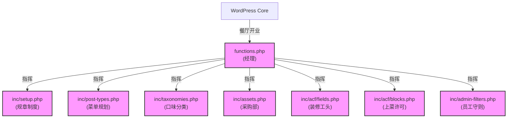
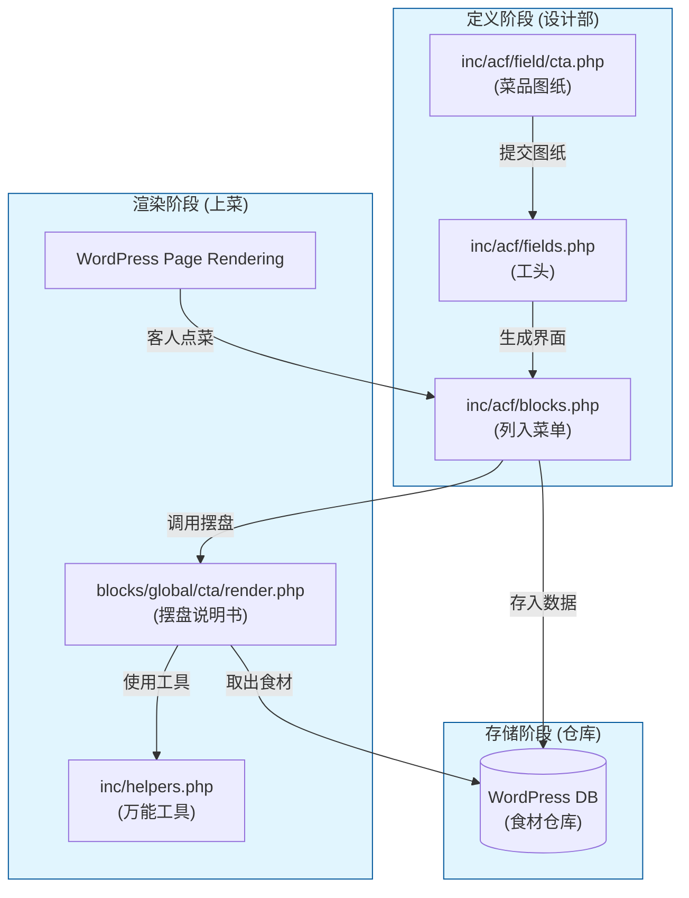
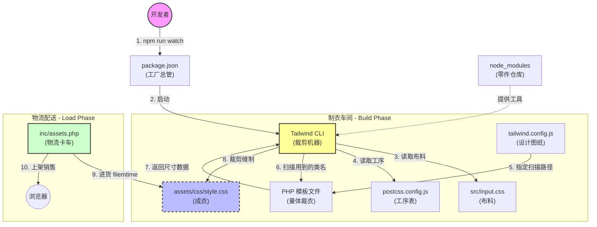
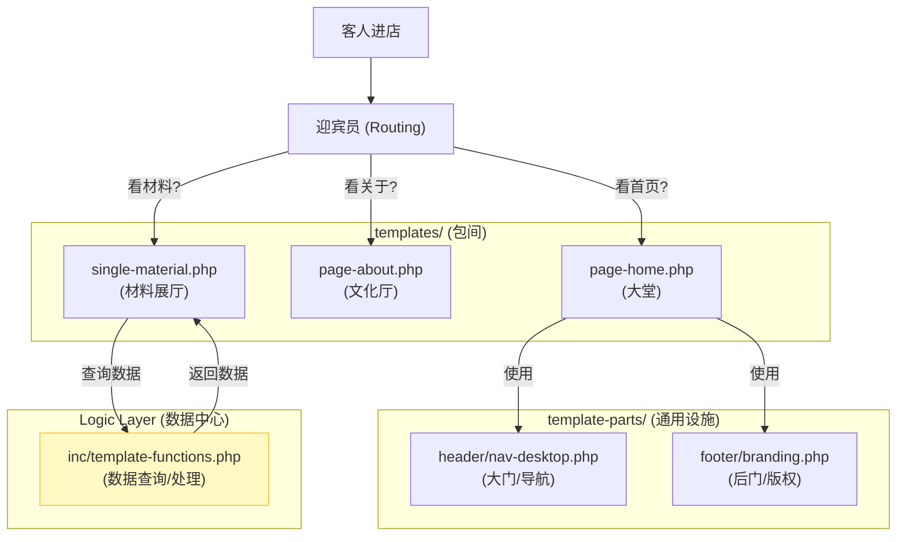

# 项目架构与文件协同指南 (Project Architecture & Collaboration Guide)

本文档旨在梳理 GeneratePress Child 主题下的项目结构，解释各个文件的核心作用以及它们之间如何协同工作。

## 1. 核心文件结构概览 (Directory Structure)

```text
/wp-content/themes/generatepress_child/
├── functions.php              # [总指挥] 主题入口，负责加载 inc/ 下的所有模块
├── style.css                  # [身份证] 仅用于定义主题元数据，不写样式
├── inc/                       # [功能库] 所有 PHP 逻辑代码的存放地
│   ├── setup.php              # [初始化] 主题的基础配置、Gutenberg 开关、路由重定向
│   ├── assets.php             # [资源加载] 负责加载 CSS (Tailwind) 和 JS
│   ├── helpers.php            # [工具箱] 全局辅助函数 (如 _3dp_render_block, get_field_value)
│   ├── post-types.php         # [数据模型] 注册 CPT (Material, Capability 等)
│   ├── taxonomies.php         # [分类法] 注册 Taxonomy (Process, Type 等)
│   ├── template-functions.php # [业务逻辑] 前端模板专用的复杂查询逻辑
│   ├── admin-filters.php      # [后台增强] 列表页筛选、批量操作
│   ├── duplicate.php          # [后台工具] 文章复制功能
│   ├── options-page.php       # [全局数据] ACF Options Page 配置
│   └── acf/                   # [ACF 系统]
│       ├── blocks.php         # [积木注册] 注册 ACF Block (关联字段与渲染模板)
│       ├── fields.php         # [字段加载] 自动加载 field/, cpt/, pages/ 下的字段
│       ├── field/             # [积木字段] 各个 Block 的字段定义
│       ├── cpt/               # [CPT字段] CPT 专属字段
│       ├── pages/             # [页面字段] Page Template 专属字段
│       └── taxonomy/          # [分类字段] Taxonomy 扩展字段
├── blocks/
│   └── global/                # [积木渲染] 所有 ACF Block 的前端渲染文件 (render.php)
├── templates/                 # [页面模板] 全定制的 Page Templates (如 Home, Contact)
├── template-parts/            # [UI 组件] 可复用的 UI 片段 (Header, Footer, Cards)
└── docs/                      # [文档库] 项目文档
```

---

## 2. 餐厅比喻：形象化理解架构 (The Restaurant Metaphor)

为了让非技术背景的团队成员也能快速理解，我们将整个 WordPress 网站比作一家**高级餐厅**。

### 2.1 根目录 (`/`) = 餐厅前厅 (Dining Area)
**这里是顾客（用户）直接看到的地方。**

*   **`functions.php` (餐厅经理)**:
    *   **角色**: 他不亲自做饭，也不亲自端菜。
    *   **职责**: 他负责指挥所有人工作。“后厨(inc)准备好菜单”，“采购部(assets)把菜买回来”，“装修队(ACF)把包间布置好”。他是整个餐厅的总调度。
*   **`style.css` (营业执照)**:
    *   **角色**: 挂在墙上的证书。
    *   **职责**: 告诉工商局（WordPress）：这家店叫什么名字，老板是谁，版本号是多少。它不负责具体的装修风格（那是 Tailwind 的事）。
*   **`front-page.php` (大堂主桌)**:
    *   **角色**: 最显眼的用餐区。
    *   **职责**: 决定首页长什么样。
*   **`templates/` (主题包间)**:
    *   **角色**: 专门为特定客人准备的房间，如“关于我们厅”、“联系我们厅”。
    *   **职责**: 提供定制化的用餐体验。

---

### 2.2 `inc/` 目录 = 餐厅后勤中心 (Kitchen & Office)
**这里是顾客看不见，但维持餐厅运转的核心区域。**

*   **`inc/setup.php` (规章制度手册)**:
    *   **职责**: 规定餐厅的营业规则。比如“我们要不要提供缩略图服务？”，“我们的菜单有哪几个板块？”。
*   **`inc/assets.php` (采购部)**:
    *   **职责**: 负责把外面的好东西运进来。加载 Tailwind CSS（装修材料）、Google Fonts（装饰画）、JS 脚本（各种餐具）。
*   **`inc/post-types.php` & `taxonomies.php` (菜单规划师)**:
    *   **职责**: 定义我们要卖什么。
    *   **Post Types**: 定义“主菜”（Material）、“甜点”（Capability）。
    *   **Taxonomies**: 定义“川菜/粤菜”（Process）、“微辣/特辣”（Type）。
*   **`inc/acf/` (装修设计部)**:
    *   **职责**: 负责设计后台填数据的界面。
    *   **`fields.php` (工头)**: 拿着图纸指挥大家干活。
    *   **`field/*.php` (具体图纸)**: 每一张图纸定义了一个具体的模块（比如 CTA 模块要填标题、图片、按钮）。
*   **`inc/options-page.php` (中央厨房)**:
    *   **职责**: 存放所有通用的配料（全局数据）。比如网站的 Logo、页脚的版权信息，改一次，全餐厅都变。

---

### 2.3 `blocks/` 目录 = 预制菜品 (Pre-made Dishes)
**这里存放的是一个个独立的、可复用的功能模块。**

*   **职责**: 每一个 Block（如 CTA、Hero Banner）就像一道道标准的预制菜。
*   **协同**:
    1.  **后台**: 厨师（编辑）在后台按照图纸（ACF Field）填好料。
    2.  **前台**: 服务员端上来的时候，根据渲染说明书（`render.php`）把这道菜摆盘好给客人看。

---

## 3. 协同工作流程图解 (Collaboration Flows)

### 3.1 主题启动流程 (Bootstrapping)

当 WordPress 启动时，`functions.php` (经理) 开始点名，唤醒各个部门。



### 3.2 ACF Block 系统协同 (Block System)

这是本项目最核心的部分。一个 Block (一道菜) 的诞生需要三个部门的配合。



### 3.3 Tailwind CSS 编译流程 (Garment Factory)

我们将 Tailwind CSS 的构建流程比作**"开设一家高级定制服装厂"**。

*   **`package.json` (工厂总管)**: 拿着操作手册 (`scripts`)，只要听到口令 `npm run watch`，就启动机器。
*   **`package-lock.json` (仓库进货详单)**: 确保所有机器和零件（依赖包）的型号在任何地方都是完全一致的，防止"上次用的螺丝是 5mm，这次自动变成了 6mm"的风险。
*   **`node_modules` (工人宿舍与零件仓库)**: 这里住着所有的工人和机器零件（依赖包）。这是闲人免进的黑盒，开发者不需要进去，只要知道干活的工具都在这里就行。
*   **`postcss.config.js` (车间工序表)**: 告诉机器，衣服做出来后，还需要经过哪些特殊的处理工序。它是一个"操作指令卡"，告诉 PostCSS 这个大平台先挂载 `tailwindcss` 插件做裁剪，再挂载 `autoprefixer` 插件给衣服熨烫平整（加浏览器前缀），确保衣服在任何人的身上（不同浏览器）都服帖。
*   **`tailwind.config.js` (设计师图纸)**: 规定了我们要用什么布料（颜色）、做什么尺码（间距），以及要去哪些房间（PHP文件）量尺寸。
*   **`src/input.css` (布料)**: 原始的 CSS 代码。
*   **`assets/css/style.css` (成衣)**: 机器生产出来的最终成品，挂在橱窗里（浏览器）。
*   **`inc/assets.php` (物流卡车)**: 负责把成衣从工厂运到商场（网页），并且每次新款发布（文件修改）都会自动换个标签（版本号），告诉顾客这是新款。



### 3.4 页面渲染与模板层级 (Template Hierarchy)

当用户访问一个页面时，WordPress 根据 URL 决定带客人去哪个房间。


