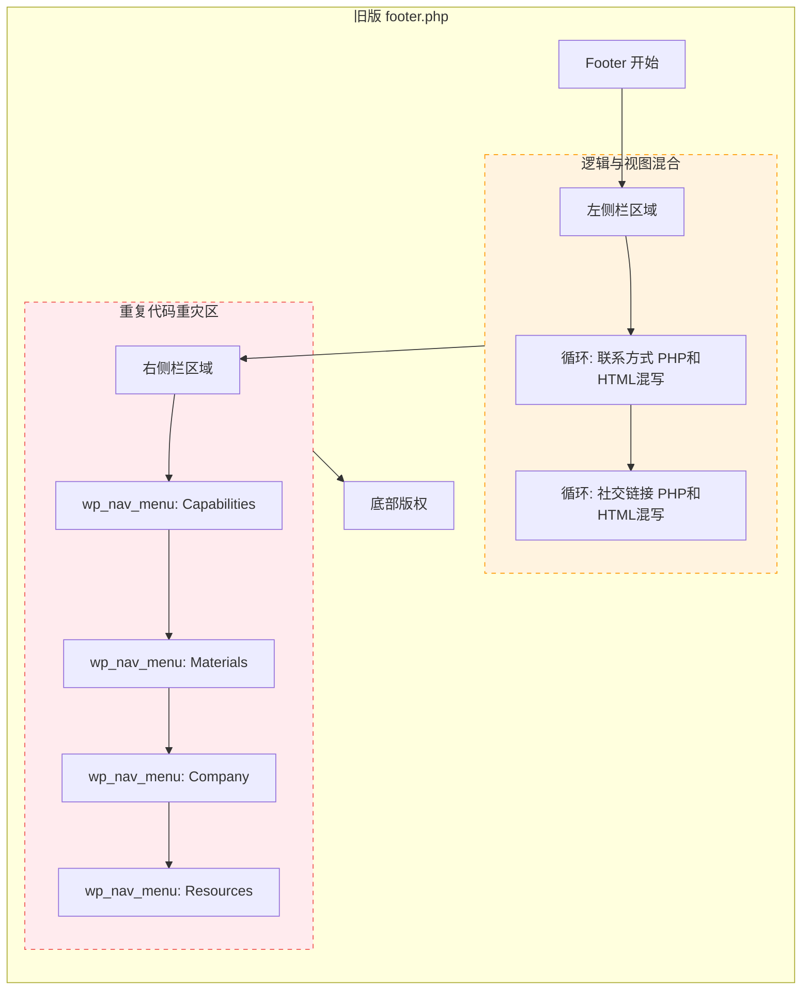
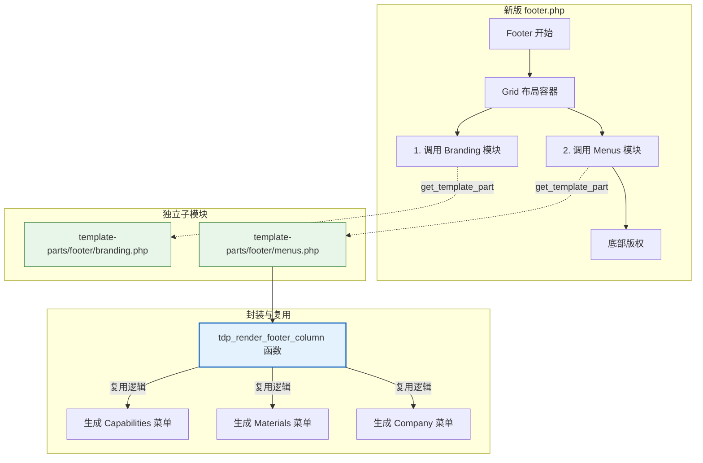

# Footer 重构：从"平铺直叙"到"模块化封装"

本文档记录了 `footer.php` 的架构优化过程。这次重构的核心目标是**消除重复代码 (DRY)** 并提升代码结构的清晰度。

## 1. 核心理念对比

为了形象地理解这次重构，我们可以把 `footer.php` 想象成一张**复杂的报纸版面**。

### 优化前：**"手写排版"的报纸**
*   **角色**：编辑（footer.php）必须亲自手写每一栏的内容。
*   **工作方式**：
    *   为了在左边放联系方式，他手写了一段 HTML。
    *   为了在中间放"Capabilities"菜单，他抄了一遍菜单代码。
    *   为了在右边放"Materials"菜单，他又抄了一遍几乎一模一样的代码，只是改了个标题。
*   **痛点**：如果你想给所有菜单加个小图标，你得在报纸上改 4 个地方，非常容易漏掉一个，导致版面不统一。

### 优化后：**"智能排版"的报纸**
*   **角色**：编辑升级成了**版面总监**。
*   **工作方式**：
    *   他不再手写内容，而是使用**"印章"**（Helper Function）。
    *   "在这里盖一个菜单印章，标题叫 Capabilities" -> 机器自动生成标准样式的菜单。
    *   "在这里贴一个品牌模块" -> 直接引用做好的品牌组件。
*   **优点**：样式高度统一，改一个印章，全报纸生效。

---

## 2. 架构流程对比图 (Mermaid)

### 优化前 (Before Refactoring)

大量的重复代码和混合逻辑，使得文件冗长且难以维护。

### 优化后 (After Refactoring)

结构清晰，逻辑分离，重复代码被封装。

---

## 3. 文件拆分详情

| 文件名 | 角色 | 职责 |
| :--- | :--- | :--- |
| **[footer.php](../footer.php)** | **版面总监** | 负责整体 Grid 布局结构和版权信息。 |
| **[template-parts/footer/branding.php](../template-parts/footer/branding.php)** | **品牌专栏** | 独立处理 Logo、联系方式列表和社交媒体图标，逻辑与视图分离。 |
| **[template-parts/footer/menus.php](../template-parts/footer/menus.php)** | **菜单排版机** | 封装了 `tdp_render_footer_column` 函数，统一管理所有 Footer 菜单的渲染逻辑。 |

## 4. 核心改进点

1.  **消除重复 (DRY)**: 所有的 `wp_nav_menu` 调用被统一封装。以前要改 4 个地方的样式，现在只需要改 `tdp_render_footer_column` 函数。
2.  **逻辑分离**: 联系方式的 PHP 循环不再干扰菜单的布局代码，阅读体验大幅提升。
3.  **模块化**: 如果未来要改版 Footer 的左侧（品牌区域），完全不需要触碰右侧（菜单区域）的代码。
