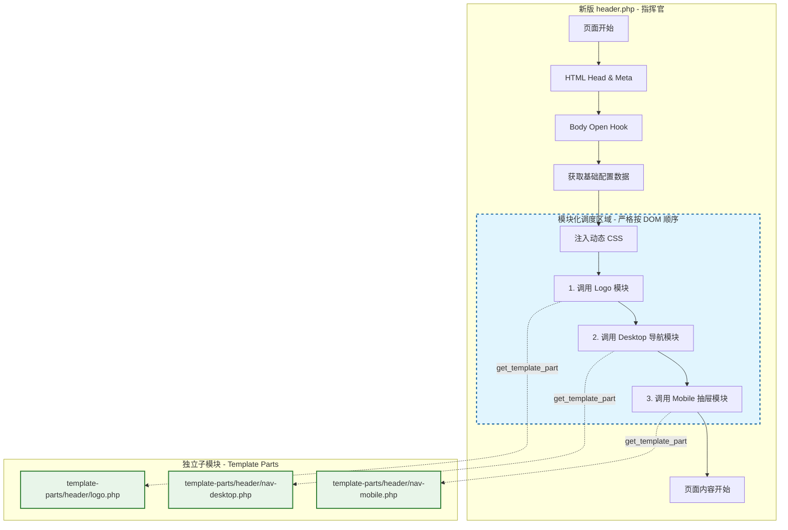

# Header 重构：从"大杂烩"到"流水线"

本文档记录了 `header.php` 的架构优化过程。这次重构没有改变任何业务逻辑（功能完全一致），而是极大地提升了代码的可维护性和清晰度。

## 1. 核心理念对比

为了形象地理解这次重构，我们可以把 `header.php` 想象成一家**高级餐厅的厨房**。

### 优化前：**"大杂烩"式的一人厨房**

* **角色**：只有一个超级忙碌的主厨（header.php）。
* **工作方式**：他在同一个大房间里做所有事——切菜、炒菜、摆盘、洗碗。
* **痛点**：如果你想换个"Logo 拼盘"的做法，你得小心翼翼地绕过正在炒菜的锅，非常容易撞翻旁边的东西（改出 Bug）。整个厨房乱成一团，只有主厨自己知道什么东西在哪里。

### 优化后：**"米其林"式的流水线厨房**

* **角色**：`header.php` 升级成了**行政总厨**（Manager）。
* **工作方式**：他**不再亲自做菜**，只负责喊单（调度）。具体的菜品由专门的负责人在各自的独立操作间里制作。
* **优点**：各司其职，互不干扰，清晰整洁。

---

## 2. 架构流程对比图 (Mermaid)

### 优化前 (Before Refactoring)

所有的逻辑都挤在一个文件里，就像一团纠缠不清的线。

```mermaid
graph TD
    subgraph OldHeader [旧版 header.php 约500行]
  
        Start[页面开始] --> Head[HTML Head & Meta]
        Head --> Body[Body Open Hook]
  
        Body --> Data[获取所有 ACF 数据]
        Data --> Style[注入动态 Logo CSS]
  
        subgraph MixedArea [混乱的混合区域]
            Style --> NavStart[导航栏容器开始]
            NavStart --> LogoLogic[Logo 判断与渲染逻辑]
            LogoLogic --> DeskNav[桌面端菜单 HTML 结构]
            DeskNav --> DeskLoop[循环遍历: 桌面端菜单项]
            DeskLoop --> MobToggle[移动端开关按钮]
            MobToggle --> MobDrawer[移动端抽屉 HTML 结构]
            MobDrawer --> MobLoop[循环遍历: 移动端菜单项]
            MobLoop --> NavEnd[导航栏容器结束]
        end
  
        NavEnd --> PageStart[页面内容开始]
    end
  
    %% 样式定义：绑定到子图的 ID (MixedArea) 上
    style MixedArea fill:#f9f2f4,stroke:#d62728,stroke-dasharray: 5 5,stroke-width:2px
```

### 优化后 (After Refactoring)

现在的 `header.php` 变成了指挥官，通过 `get_template_part` 调度各个子模块。

---

## 3. 文件拆分详情

| 文件名                                                                                   | 角色                   | 职责                                                               |
| :--------------------------------------------------------------------------------------- | :--------------------- | :----------------------------------------------------------------- |
| **[header.php](../header.php)**                                                       | **行政总厨**     | 只保留 HTML 骨架 (`<html>`, `<head>`, `<body>`) 和顶层调度。 |
| **[template-parts/header/logo.php](../template-parts/header/logo.php)**               | **Logo 专员**    | 负责 Logo 的判断、加载优化 (LCP) 和回退显示。                      |
| **[template-parts/header/nav-desktop.php](../template-parts/header/nav-desktop.php)** | **桌面菜单专员** | 负责宽屏下的 Mega Menu 渲染。                                      |
| **[template-parts/header/nav-mobile.php](../template-parts/header/nav-mobile.php)**   | **手机菜单专员** | 负责移动端抽屉菜单、Toggle 按钮及交互。                            |

## 4. 为什么这样做？

1. **可维护性 (Maintainability)**: 如果你想改移动端菜单，直接去 `nav-mobile.php`，不用在 500 行代码里翻找。
2. **关注点分离 (Separation of Concerns)**: Logo 逻辑和菜单逻辑互不干扰，减少了"改了一个坏了另一个"的风险。
3. **代码清晰度 (Readability)**: 主文件从 500 行缩减到 100 行，逻辑一目了然。
