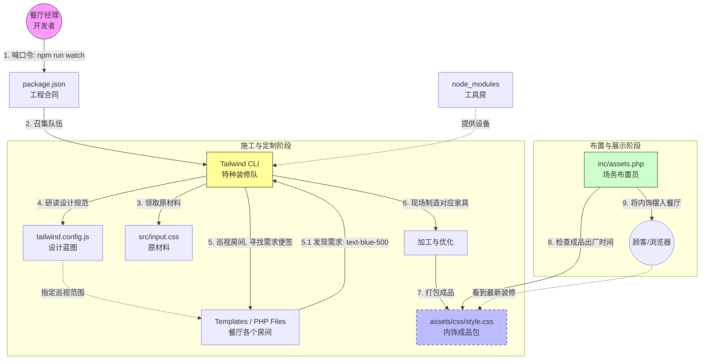

# Tailwind CSS 架构与编译流程详解 (餐厅装修篇)

本文档将 Tailwind CSS 的架构与编译流程整合，并融入项目的**"餐厅隐喻"**体系。如果说 WordPress 主题是餐厅的**经营与服务**体系，那么 Tailwind CSS 就是餐厅的**"动态装修与内饰定制系统"**。

---

## 1. 核心概念：装修团队 (The Renovation Team)

在传统的餐厅（传统 CSS 开发）中，装修工需要提前把所有的墙纸、桌布、椅子都做好放在仓库里，不管用不用得上（加载庞大的 CSS 文件）。

而 Tailwind CSS 是一支**"按需定制"**的特种装修队。他们不预先生产任何家具，而是盯着餐厅的每一个角落（扫描 PHP 文件），一旦发现经理（开发者）在墙上贴了便签 "这里要蓝色背景" (`bg-blue-500`)，他们就立刻在后院（内存）制造出这块蓝布，并精准安装上去。

---

## 2. 架构角色详解 (Role Mapping)

我们将各个文件对应到餐厅装修的各个环节：

### 📄 [package.json](../package.json) —— 装修工程合同
*   **角色**：总施工合同
*   **隐喻**：这份合同规定了我们要聘请哪家装修公司（Tailwind Labs），以及开工的口令（`scripts`）。
*   **关键动作**：当你喊出 `npm run watch`，就是签署了"开始实时装修"的命令，施工队进场。

### 📦 [node_modules](../node_modules) —— 施工队工具房
*   **角色**：工具与设备间
*   **隐喻**：这里堆放着电锯、油漆桶、缝纫机（Tailwind 引擎、PostCSS 插件）。这是施工队的禁地，餐厅经理（开发者）不需要进去，只要知道里面有干活的工具就行。

### 🎨 [tailwind.config.js](../tailwind.config.js) —— 装修设计蓝图
*   **角色**：首席设计师规范
*   **隐喻**：这是餐厅的设计总则。
    *   **Theme**: 规定了餐厅的"品牌色"是哪种蓝，"圆桌"的半径是多少。
    *   **Content**: 告诉施工队去哪些房间（文件路径）巡视。如果漏写了某个房间，施工队就不会去那里看，那里的装修需求就会被忽略。

### 📄 [postcss.config.js](../postcss.config.js) —— 车间工序表
*   **角色**：操作指令卡
*   **隐喻**：如果把生产过程比作流水线，这个文件就是给 PostCSS 这个大机器的**"工序操作表"**。它告诉机器要按什么顺序挂载钻头（插件）来干活。
    *   **Tailwind 插件**: 第一道工序，负责"裁剪与缝制"（将 `@tailwind` 指令转译为 CSS）。
    *   **Autoprefixer 插件**: 第二道工序，负责"熨烫与包装"（自动添加 `-webkit-` 等浏览器前缀），确保衣服在任何人的身上（不同浏览器）都服帖。
*   **为什么需要它**: Tailwind 本身只是一个插件，必须挂载在 PostCSS 这个大平台上才能运行。没有这张指令卡，机器就不知道该干什么。

### 🧶 [src/input.css](../src/input.css) —— 基础原材料
*   **角色**：原材料清单
*   **隐喻**：这是装修用的基础布料和底漆。里面包含了 Tailwind 的三大基本指令（Base, Components, Utilities）。你也可以在这里塞入一些特殊的、买不到的自定义装饰品。

### 🖼️ [assets/css/style.css](../assets/css/style.css) —— 最终交付的内饰包
*   **角色**：成品仓库
*   **隐喻**：这是施工队干完活后，打包好的**"全套内饰成品"**。
    *   它只包含餐厅里**实际用到**的家具和装饰。
    *   **警告**：绝对不要手动去改这个成品，因为施工队每次开工都会把旧的扔掉，重新造一套新的。

### 🚚 [inc/assets.php](../inc/assets.php) —— 场务布置员
*   **角色**：布置与更新人员
*   **隐喻**：施工队只管造（编译 CSS），**场务员**负责把造好的内饰真正**摆放**到餐厅里（Enqueue Style）。
    *   **智能更新**：每当施工队交付了新款式（文件更新），场务员会给内饰贴上一个新的标签（版本号 `?ver=...`），确保顾客看到的永远是按照最新蓝图装修的样子，而不是旧的缓存幻象。

---

## 3. 装修与即时响应流程 (The Workflow)

这个流程图展示了从你下达"开工"指令，到顾客看到崭新餐厅的全过程。

### 步骤详解

1.  **启动 (Start)**: 经理喊出 `npm run watch`，装修队（CLI）进驻现场，开始待命。
2.  **巡视 (Scan)**: 装修队根据 **设计蓝图**，拿着放大镜在 **餐厅房间**（PHP 文件）里转悠。
3.  **发现需求 (Detect)**: 他们在墙上看到你贴了个便签：`class="p-4 bg-white"`。
    *   *心里旁白*: "老板想要 1rem 的内边距和白色背景。"
4.  **制造 (Build)**: 他们立刻用 **原材料** 裁剪出对应的样式代码。
    *   *注意*: 如果你在蓝图里写了 `text-red-500` 但没在任何房间贴这个便签，装修队**绝对不会**制造这个红色的装饰。这就是为什么成品包如此轻便。
5.  **交付 (Output)**: 生成最终的 **内饰成品包** (`style.css`)。
6.  **布置 (Enqueue)**: **场务员** (`assets.php`) 发现成品包更新了，立马把它挂载到网页头部，并打上新的时间戳，强制浏览器刷新。

## 总结

在 GeneratePress Child 主题的餐厅里：
*   **PHP 模板** 是骨架和房间结构。
*   **Tailwind** 是那支随叫随到的神笔马良装修队。
*   **你** 是总设计师，只需要在墙上（HTML Class）写下你的愿望，装修队就会在毫秒间为你实现。
