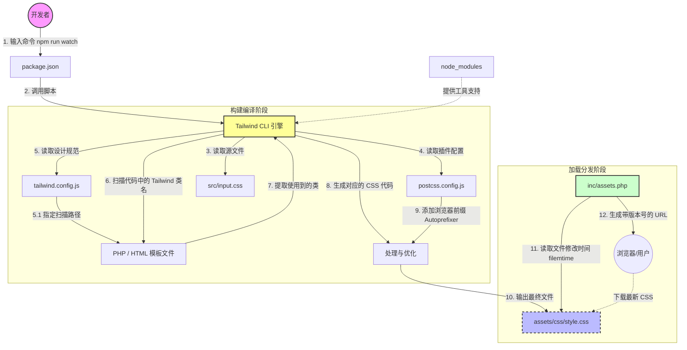

# Tailwind CSS 编译流程图解

这个流程图展示了当你运行构建命令时，各个文件是如何协同工作，最终生成 `style.css` 的。

## 核心流程图 (Mermaid)

## 后续直接照着这个流程来就行了

## 步骤详细解析

### 1. 启动引擎 (Start)

* **动作**: 你在终端输入 `npm run watch`。
* **涉及文件**: [package.json](../package.json)
* **解释**: `npm` 去 `scripts` 里找到对应的命令，唤醒沉睡在 `node_modules` 里的 **Tailwind CLI** 工具。
* 

当你敲下 `npm run watch`（或直接运行 `tailwindcss -i input.css -o style.css --watch`）时，你就唤醒了这个 CLI 引擎。它在这个过程中扮演着三个角色：

* **🕵️‍♂️ 侦探（扫描器）** ：它会根据 `tailwind.config.js` 的指示，去全盘扫描你的 PHP 和 HTML 文件。看到你写了 `text-blue-500`，它就在小本本上记下来。
* **⚙️ 翻译官（编译器）** ：它把记下来的类名，配合你的配置，瞬间翻译成真正的 CSS 代码（`color: #3b82f6;`）。
* **🧹 清洁工（优化器）** ：最后，它会把那些你没用到的 Tailwind 基础样式全部剔除，然后输出一个极其精简的 `style.css` 给你（这也是为什么你的网站能跑出 99 分的原因，因为 CSS 文件极小）。

### 2. 加载配置 (Load Configs)

* **动作**: CLI 启动后，立刻去寻找它的"说明书"。
* **涉及文件**:
  * [postcss.config.js](../postcss.config.js): 告诉 CLI："嘿，干完活记得叫 `autoprefixer` 来把衣服熨平（加前缀）。"
  * [tailwind.config.js](../tailwind.config.js): 告诉 CLI："我们的主色调是蓝色，圆角是 12px，不要自作主张。"

### 3. 扫描内容 (Scan Content)

* **动作**: 这是最关键的一步。CLI 根据 `tailwind.config.js` 的 `content` 字段，去遍历所有的 PHP 文件。
* **涉及文件**: `**/*.php` (模板文件)
* **解释**:
  * CLI 会像雷达一样扫描你的代码。
  * 它发现你在 `header.php` 里写了 `
`。
  * 它记录下：*"老板用到了 `bg-primary` 和 `p-4`，我需要生成这两个类的 CSS。"*
  * **注意**: 如果你写了类名但没在 PHP 里用，Tailwind **绝对不会** 生成它。这就是为什么它生成的 CSS 只有几十 KB，而不是几 MB。

### 4. 读取原材料 (Read Input)

* **动作**: CLI 读取你的 CSS 入口文件。
* **涉及文件**: [src/input.css](../src/input.css)
* **解释**: 它把 `@tailwind base` 等指令展开，并把你写的自定义 CSS（如 Fluent Forms 的覆盖样式）也加进去。

### 5. 生成与输出 (Generate & Output)

* **动作**: 混合所有信息，生成最终的 CSS 文件。
* **涉及文件**: [assets/css/style.css](../assets/css/style.css)
* **解释**:
  * Tailwind 把扫描到的实用类生成 CSS 代码。
  * Autoprefixer 给这些代码加上 `-webkit-` 等前缀。
  * 最终写入 `style.css`。

### 6. 加载分发 (Enqueue / Load)

* **动作**: WordPress 将生成的 CSS 文件插入到网页头部。
* **涉及文件**: [inc/assets.php](../inc/assets.php)
* **解释**:
  * 仅仅生成了 `style.css` 还没用，浏览器还不知道要去下载它。
  * `inc/assets.php` 通过 `wp_enqueue_style` 函数，告诉 WordPress："请在页面头部加载这个 CSS 文件。"
  * **缓存自动清除**: 每次 `style.css` 被重新编译，它的修改时间 (`filemtime`) 就会变。`inc/assets.php` 会把这个时间作为版本号加在 URL 后面（如 `style.css?ver=171890234`），强迫浏览器下载最新的 CSS，而不是使用旧缓存。

### 7. 持续监听 (Watch)

* **动作**: 只要你没按 `Ctrl + C` 停止，CLI 就会一直盯着这些文件。
* **解释**: 一旦你修改了 PHP 文件（加了个新类名）或者修改了 `input.css`，它会在 **毫秒级** 内重新执行步骤 3-5，实时更新 `style.css`。而当你刷新浏览器时，步骤 6 会确保你看到最新的效果。
